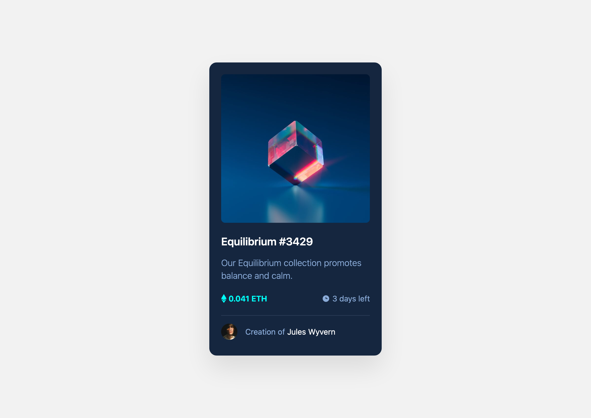

# NFT Preview Card (React + Typscript + Tailwind)

## Table of contents

- [Overview](#overview)
  - [Screenshots](#screenshots)
  - [Links](#links)
  - [Built with](#built-with)
  - [What I learned](#what-i-learned)
  - [Useful resources](#useful-resources)
- [Recommended IDE Setup](#recommended-ide-setup)
  - [VSCode Extensions](#vscode-extensions)
- [Author](#author)

## Overview
Great e-learning landing page. Pixel perfect responsive layout. Built with React.js and Tailwind CSS.

### Screenshots

### Links

- Repo URL: [https://github.com/11kyle/nft-preview-card](https://github.com/11kyle/nft-preview-card)
- Live Site URL: [https://11kyle.github.io/nft-preview-card/](https://11kyle.github.io/nft-preview-card/)

### Built with

- Semantic HTML5 markup
- Flexbox & Grid
- Mobile-first workflow
- Responsive Design
- [React](https://react.dev/) - JS library
- [Vite](https://vitejs.dev/) - React framework
- [Tailwind](https://tailwindcss.com/) - For styles

### What I learned

Keeping my CSS skills up to date!

### Useful resources

- [Stack Overflow](https://stackoverflow.com/) - Trusted collaboration & knowledge sharing platform.
- [MDN Web Docs](https://developer.mozilla.org/en-US/) - Resources for Developers by Developers.
- [TailwindCSS](https://tailwindcss.com/) - Rapidly build modern websites without ever leaving your HTML.
- [Deploying a Static Site](https://vitejs.dev/guide/static-deploy.html) - Next Generation Frontend Tooling.

## Recommended IDE Setup

- [VS Code](https://code.visualstudio.com/) 

### VSCode Extensions

- [Volar](https://marketplace.visualstudio.com/items?itemName=Vue.volar)
- [TypeScript Vue Plugin (Volar)](https://marketplace.visualstudio.com/items?itemName=Vue.vscode-typescript-vue-plugin)

## Author

- Github - [Kyle](https://github.com/11kyle)
- Frontend Mentor - [@11kyle](https://www.frontendmentor.io/profile/11kyle)
- LinkedIn - [Kyle](https://www.linkedin.com/in/kylejohnsondeveloper/)